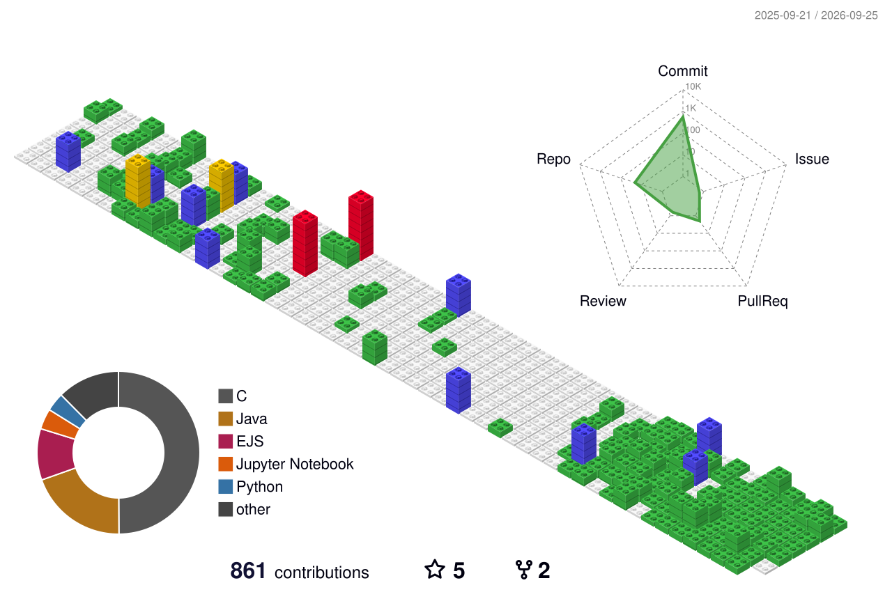

&nbsp;
&nbsp;

<div align="center">


<div align="center">


</div>

&nbsp;

<table align="center">
<tr>
<td width="50%" valign="top">

```python
#!/usr/bin/python


class SoftwareEngineer:

    def __init__(self):
        self.name = "Nour Mina"
        self.role = "Software Engineering"
        self.student = True
        self.language_spoken = ["ar_LEB", "en_US", "fr_FR"]
        self.country = "Lebanon"

    def say_hi(self):
        print("Thanks for dropping by, hope you find some of my work interesting.")

me = SoftwareEngineer()
me.say_hi()
```

</td>
<td width="50%" align="center">


</td>
</tr>
</table>

&nbsp;
&nbsp;

<div align="center">


&nbsp;
&nbsp;
---
&nbsp;
&nbsp;

<picture> <source media="(prefers-color-scheme: dark)" srcset="./profile-3d-contrib/profile-night-green.svg"> <source media="(prefers-color-scheme: light)" srcset="./profile-3d-contrib/profile-gitblock.svg">  </picture>

&nbsp;
&nbsp;
---
&nbsp;
&nbsp;

<a href="https://linkedin.com/in/nourmina"></a>
&nbsp;&nbsp;
<a href="mailto:nourmina005@gmail.com"></a>
&nbsp;&nbsp;
<a href="https://discord.gg/FfF3pZQY"></a>


&nbsp;
&nbsp;

<div align="center">
<a href="https://github.com/nourrminaa?tab=repositories">
  
</a>
</div>

</div>
</div>
